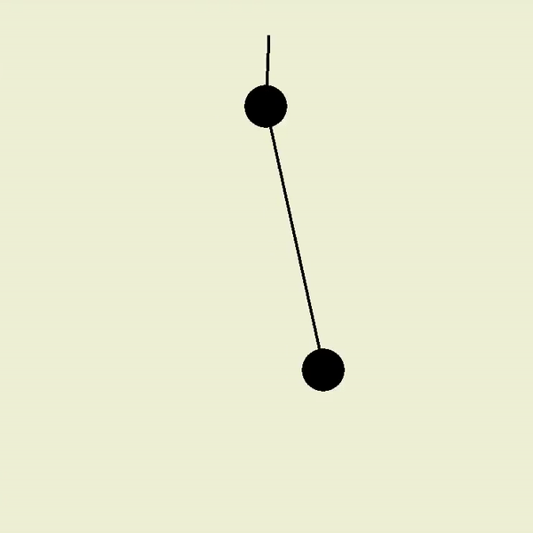

# doublePendulumSim
Simulates a double pendulum using core physics concepts.

Works with different parameters! Shown below are two examples.

(should be noted that air resistance, anchor friction, and other diminishing factors are not implemented)

